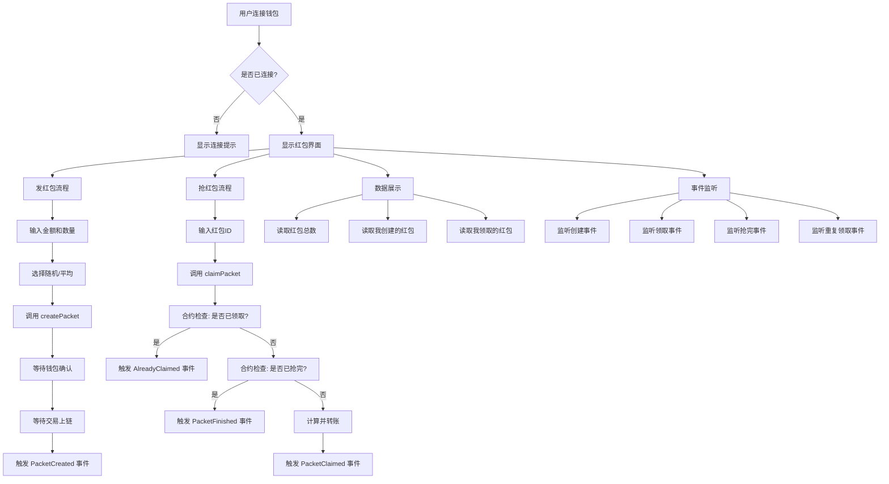

# 红包系统前端组件详解

## 📁 文件位置
`src/components/RedPacketSystem.tsx`

## 🎯 组件功能概述

这是一个完整的链上红包系统前端组件，实现了：
- 发红包（支持随机/平均分配）
- 抢红包
- 实时事件监听
- 红包列表展示
- 用户统计信息

## 🏗️ 技术栈

- **React Hooks**: useState, useEffect
- **Wagmi Hooks**:
  - `useAccount` - 获取钱包账户信息
  - `useWriteContract` - 写入合约（发红包、抢红包）
  - `useReadContract` - 读取合约数据
  - `useWaitForTransactionReceipt` - 等待交易确认
  - `useWatchContractEvent` - 监听合约事件
- **Viem**: parseEther, formatEther（金额转换）

## 📊 数据流程图



## 🔧 核心代码解析

### 1️⃣ Hooks 初始化

```typescript
export function RedPacketSystem() {
  // 1. 获取钱包账户信息
  const { address, isConnected } = useAccount();

  // 2. 表单状态
  const [amount, setAmount] = useState('');      // 红包金额
  const [count, setCount] = useState('');        // 红包数量
  const [isRandom, setIsRandom] = useState(true); // 是否随机
  const [packetId, setPacketId] = useState('');   // 要抢的红包ID
  const [notifications, setNotifications] = useState<string[]>([]); // 通知列表

  // 3. 写入合约（发红包、抢红包共用）
  const { data: hash, writeContract, isPending } = useWriteContract();

  // 4. 等待交易确认
  const { isLoading: isConfirming, isSuccess } = useWaitForTransactionReceipt({
    hash,
  });
```

**说明：**
- `useAccount`: 获取当前连接的钱包地址
- `useWriteContract`: 返回 `writeContract` 函数用于调用合约方法
- `useWaitForTransactionReceipt`: 监听交易状态（等待确认）

### 2️⃣ 读取合约数据

```typescript
// 读取红包总数
const { data: totalPackets } = useReadContract({
  address: RED_PACKET_ADDRESS as `0x${string}`,
  abi: RED_PACKET_ABI,
  functionName: 'getTotalPackets',
});

// 读取用户创建的红包列表
const { data: myPackets } = useReadContract({
  address: RED_PACKET_ADDRESS as `0x${string}`,
  abi: RED_PACKET_ABI,
  functionName: 'getCreatorPackets',
  args: address ? [address] : undefined, // 传入用户地址
});

// 读取用户领取的红包列表
const { data: claimedPackets } = useReadContract({
  address: RED_PACKET_ADDRESS as `0x${string}`,
  abi: RED_PACKET_ABI,
  functionName: 'getUserClaimedPackets',
  args: address ? [address] : undefined,
});
```

**工作原理：**
- `useReadContract` 会自动调用合约的只读方法
- 返回的数据会自动更新（当区块变化时）
- 无需手动刷新，Wagmi 会自动缓存和更新数据

### 3️⃣ 事件监听（实时通知）

```typescript
// 监听红包创建事件
useWatchContractEvent({
  address: RED_PACKET_ADDRESS as `0x${string}`,
  abi: RED_PACKET_ABI,
  eventName: 'PacketCreated',
  onLogs(logs) {
    logs.forEach((log: any) => {
      addNotification(
        `🎉 新红包创建！ID: ${log.args.packetId}, 金额: ${formatEther(log.args.totalAmount)} ETH`
      );
    });
  },
});

// 监听红包领取事件
useWatchContractEvent({
  address: RED_PACKET_ADDRESS as `0x${string}`,
  abi: RED_PACKET_ABI,
  eventName: 'PacketClaimed',
  onLogs(logs) {
    logs.forEach((log: any) => {
      addNotification(
        `💰 红包被领取！ID: ${log.args.packetId}, 金额: ${formatEther(log.args.amount)} ETH`
      );
    });
  },
});

// 监听红包抢完事件
useWatchContractEvent({
  address: RED_PACKET_ADDRESS as `0x${string}`,
  abi: RED_PACKET_ABI,
  eventName: 'PacketFinished',
  onLogs(logs) {
    logs.forEach((log: any) => {
      addNotification(`🎊 红包已抢完！ID: ${log.args.packetId}`);
    });
  },
});

// 监听重复领取事件
useWatchContractEvent({
  address: RED_PACKET_ADDRESS as `0x${string}`,
  abi: RED_PACKET_ABI,
  eventName: 'AlreadyClaimed',
  onLogs(logs) {
    logs.forEach((log: any) => {
      addNotification(`⚠️ 你已经领取过这个红包了！ID: ${log.args.packetId}`);
    });
  },
});
```

**工作原理：**
- `useWatchContractEvent` 建立 WebSocket 连接
- 实时监听链上事件
- 每当事件触发时，调用 `onLogs` 回调
- `log.args` 包含事件参数

### 4️⃣ 发红包流程

```typescript
const handleCreatePacket = async () => {
  // 1. 验证输入
  if (!amount || !count) {
    alert('请输入金额和数量');
    return;
  }

  try {
    // 2. 调用合约方法
    writeContract({
      address: RED_PACKET_ADDRESS as `0x${string}`,
      abi: RED_PACKET_ABI,
      functionName: 'createPacket',  // 合约方法名
      args: [BigInt(count), isRandom], // 方法参数：数量、是否随机
      value: parseEther(amount),       // 附带的 ETH 金额
    });
  } catch (error) {
    console.error('创建失败:', error);
    alert('创建失败: ' + (error as Error).message);
  }
};
```

**执行流程：**
1. 用户点击"发红包"按钮
2. 验证表单输入
3. 调用 `writeContract` 触发钱包确认
4. 用户在 MetaMask 中确认交易
5. 交易发送到区块链
6. `isPending` 变为 true（等待确认）
7. 交易上链后，`isConfirming` 变为 true
8. 交易确认成功，`isSuccess` 变为 true
9. 触发 `PacketCreated` 事件
10. 实时通知显示新红包信息

### 5️⃣ 抢红包流程

```typescript
const handleClaimPacket = async () => {
  // 1. 验证输入
  if (!packetId) {
    alert('请输入红包ID');
    return;
  }

  try {
    // 2. 调用合约方法
    writeContract({
      address: RED_PACKET_ADDRESS as `0x${string}`,
      abi: RED_PACKET_ABI,
      functionName: 'claimPacket',     // 合约方法名
      args: [BigInt(packetId)],        // 红包ID
    });
  } catch (error) {
    console.error('领取失败:', error);
    alert('领取失败: ' + (error as Error).message);
  }
};
```

**执行流程：**
1. 用户输入红包ID，点击"抢红包"
2. 调用 `writeContract` 触发钱包确认
3. 合约执行检查：
   - ✅ 红包是否存在？
   - ✅ 用户是否已领取？（检查 `mapping`）
   - ✅ 红包是否还有剩余？
4. 检查通过后：
   - 计算本次领取金额（随机或平均）
   - 标记用户已领取
   - 转账 ETH 到用户地址
   - 触发 `PacketClaimed` 事件
5. 如果是最后一个红包，额外触发 `PacketFinished` 事件

### 6️⃣ 红包卡片子组件

```typescript
function PacketCard({ packetId }: { packetId: bigint }) {
  // 读取单个红包详情
  const { data: packetInfo } = useReadContract({
    address: RED_PACKET_ADDRESS as `0x${string}`,
    abi: RED_PACKET_ABI,
    functionName: 'getPacketInfo',
    args: [packetId],
  });

  if (!packetInfo) return null;

  // 解构返回的数据
  const [creator, totalAmount, remainingAmount, totalCount, remainingCount, createdAt, isRandom] = packetInfo;

  // 计算剩余进度
  const progress = Number(remainingCount) / Number(totalCount);

  return (
    <div style={styles.packetCard}>
      {/* 显示红包ID和类型 */}
      <span>红包 #{packetId.toString()}</span>
      <span>{isRandom ? '随机' : '平均'}</span>

      {/* 显示金额和数量 */}
      <p>总金额: {formatEther(totalAmount)} ETH</p>
      <p>剩余: {formatEther(remainingAmount)} ETH</p>
      <p>个数: {remainingCount.toString()}/{totalCount.toString()}</p>

      {/* 进度条 */}
      <div style={{ width: `${progress * 100}%` }} />
    </div>
  );
}
```

**特点：**
- 每个红包卡片独立查询数据
- 实时显示红包状态
- 进度条颜色根据剩余比例变化

## 🔄 完整交互流程

### 发红包完整流程

```
用户操作                前端状态                    区块链操作
────────────────────────────────────────────────────────────────
输入金额 0.01 ETH      amount = "0.01"
输入数量 3个           count = "3"
选择随机红包           isRandom = true

点击"发红包"按钮       调用 handleCreatePacket()
                      ↓
                      writeContract({
                        value: 0.01 ETH
                        args: [3, true]
                      })
                      ↓
                      isPending = true             弹出 MetaMask
用户在钱包确认                                     ↓
                                                   发送交易到网络
                      isConfirming = true          ↓
                                                   矿工打包交易
                                                   ↓
                                                   合约执行:
                                                   - 创建红包记录
                                                   - 存储金额 0.01 ETH
                                                   - 触发 PacketCreated 事件
                      ↓
接收到事件通知         isSuccess = true
显示"新红包创建"       ↓
清空表单              setAmount('')
                      setCount('')
                      ↓
红包列表自动更新       myPackets 自动刷新
```

### 抢红包完整流程

```
用户操作                前端状态                    区块链操作
────────────────────────────────────────────────────────────────
输入红包ID: 0         packetId = "0"

点击"抢红包"按钮       调用 handleClaimPacket()
                      ↓
                      writeContract({
                        args: [0]
                      })
                      ↓
                      isPending = true             弹出 MetaMask
用户在钱包确认                                     ↓
                                                   发送交易到网络
                      isConfirming = true          ↓
                                                   矿工打包交易
                                                   ↓
                                                   合约执行 claimPacket(0):
                                                   ├─ 检查红包是否存在 ✓
                                                   ├─ 检查是否已领取
                                                   │  └─ 是 → 触发 AlreadyClaimed
                                                   │  └─ 否 → 继续
                                                   ├─ 检查是否还有剩余
                                                   │  └─ 否 → 触发 PacketFinished
                                                   │  └─ 是 → 继续
                                                   ├─ 计算领取金额
                                                   │  └─ 随机: random()
                                                   │  └─ 平均: total / count
                                                   ├─ 标记已领取
                                                   ├─ 转账 ETH 到用户
                                                   └─ 触发 PacketClaimed 事件
                      ↓
接收到事件通知         isSuccess = true
显示"红包领取成功"     ↓
清空表单              setPacketId('')
                      ↓
统计数据自动更新       claimedPackets 自动刷新
```

## 🎨 UI 组件结构

```
RedPacketSystem
├── 统计卡片区域
│   ├── 合约地址
│   ├── 红包总数
│   ├── 我创建的红包数
│   └── 我领取的红包数
│
├── 操作区域（左右布局）
│   ├── 发红包卡片
│   │   ├── 金额输入框
│   │   ├── 数量输入框
│   │   ├── 随机/平均选择
│   │   └── 发红包按钮
│   │
│   └── 抢红包卡片
│       ├── 红包ID输入框
│       ├── 抢红包按钮
│       └── 提示信息
│
├── 交易状态区域（条件显示）
│   ├── 交易哈希
│   └── 成功提示
│
├── 实时通知面板（条件显示）
│   └── 通知列表（最多10条）
│
└── 我的红包列表（条件显示）
    └── PacketCard 组件列表
        ├── 红包ID和类型
        ├── 金额信息
        ├── 数量信息
        └── 进度条
```

## ⚡ 性能优化

### 1. 自动数据刷新
```typescript
// useReadContract 会自动订阅区块变化
const { data: totalPackets } = useReadContract({
  // 当新区块产生时，自动重新查询
  functionName: 'getTotalPackets',
});
```

### 2. 条件渲染
```typescript
// 只在有数据时渲染
{myPackets && myPackets.length > 0 && (
  <div>我创建的红包列表</div>
)}
```

### 3. 通知列表限制
```typescript
// 只保留最新的10条通知
const addNotification = (message: string) => {
  setNotifications((prev) => [message, ...prev].slice(0, 10));
};
```

## 🛡️ 错误处理

### 1. 表单验证
```typescript
if (!amount || !count) {
  alert('请输入金额和数量');
  return;
}
```

### 2. 合约未部署检查
```typescript
disabled={RED_PACKET_ADDRESS === '0x...'}
```

### 3. Try-Catch 捕获
```typescript
try {
  writeContract({...});
} catch (error) {
  alert('操作失败: ' + (error as Error).message);
}
```

### 4. 合约层面检查
- 红包是否存在
- 用户是否已领取
- 红包是否已抢完
- 金额是否足够

## 📱 状态管理

```typescript
// 表单状态
amount       → 红包金额
count        → 红包数量
isRandom     → 是否随机
packetId     → 要抢的红包ID

// 交易状态
isPending    → 等待钱包确认
isConfirming → 交易确认中
isSuccess    → 交易成功
hash         → 交易哈希

// 数据状态
totalPackets    → 红包总数
myPackets       → 我创建的红包
claimedPackets  → 我领取的红包

// 通知状态
notifications   → 实时通知列表
```

## 🎯 关键要点总结

1. **Wagmi Hooks 是核心**
   - `useReadContract`: 读取数据（自动刷新）
   - `useWriteContract`: 写入数据（发交易）
   - `useWatchContractEvent`: 监听事件（实时通知）

2. **数据流是单向的**
   - 用户操作 → 调用合约 → 触发事件 → 更新UI

3. **事件监听很重要**
   - 提供实时反馈
   - 友好的用户体验
   - 4种事件：创建、领取、抢完、重复领取

4. **合约检查保证安全**
   - 防止重复领取
   - 检查红包状态
   - 金额正确分配

5. **类型安全**
   - TypeScript 类型定义
   - BigInt 处理大数字
   - 地址类型转换

## 🔗 相关文件

- **合约配置**: `src/contracts/RedPacket.ts`
- **智能合约**: `contracts/RedPacket.sol`
- **主应用**: `src/App.tsx`
- **钱包配置**: `src/wagmi.config.ts`

## 📚 学习资源

- Wagmi 文档: https://wagmi.sh/
- Viem 文档: https://viem.sh/
- React Hooks: https://react.dev/reference/react
- Solidity Events: https://docs.soliditylang.org/en/latest/contracts.html#events
